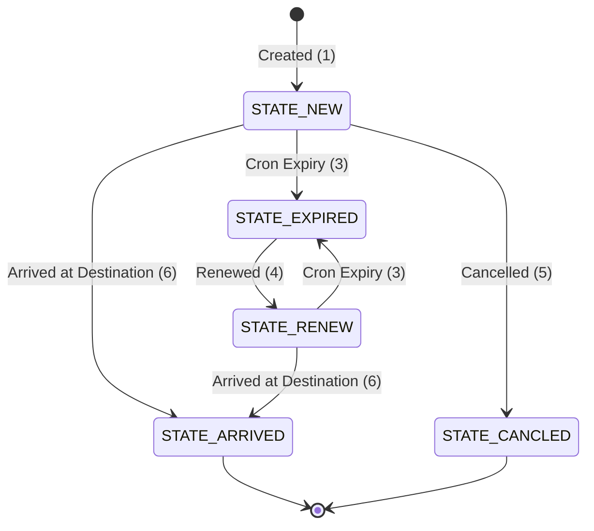

# AGENTS.md - Developer & AI Agent Guidelines

Welcome to the **Gold Travel Traditional** (`gold_travel_traditional`) Django application codebase. This file provides architectural context, coding standards, environment workflows, state machines, and guidance for AI agents and human developers working on this project.

---

## 1. Executive Summary & Domain Context

**Gold Travel Traditional** is a specialized Django application within the e-service ecosystem designed to manage and track the legal movement of gold between states using traditional mining methods (*الذهب التقليدي / أسواق التعدين التقليدي*).

### Core Responsibilities
- **Gold Movement Records**: Registering, tracking, and validating traditional gold transport permits (`AppMoveGoldTraditional`).
- **Secondary Operations**:
  - **Melting & Refining** (`MeltBatch`): Batching gold items for melting workshops and standardization labs (*استمارة تسييح ومعايرة*).
  - **Commercial Sales** (`Sale`): Issuing sale permits and invoices to exporters or goldsmiths (*استمارة بيع*).
  - **Storage Certificates** (`Storage`): Managing gold vault storage certificates with expiration windows (*شهادة تخزين*).
- **Multi-State Isolation**: Enforcing state-level data boundaries, state representative roles, and lookup scoping across Sudan states (`LkpState`).
- **Automated Lifecycle & Expiration**: Background cron jobs (`cron.py`) automatically transitioning expired permits.

---

## 2. Project Architecture & File Map

```
gold_travel_traditional/
├── AGENTS.md                  # Developer & AI Agent guidance (this file)
├── README.md                  # User-level feature summary & setup instructions
├── __init__.py
├── admin.py                   # Custom Django Admin views, permissions, actions & exports (~2.4k lines)
├── apps.py                    # AppConfig (name: 'gold_travel_traditional')
├── cron.py                    # Scheduled cron tasks for record state expiration
├── forms.py                   # ModelForms with state/user scope filtering & validations
├── models.py                  # Domain models, logging base, state enums & code generators
├── tests.py                   # Test suite for models, forms, and admin functionality
├── views.py                   # View logic (primarily routed through Admin interface)
├── data/                      # Fixtures or reference static dataset files
├── migrations/                # Database migration history
├── static/                    # Custom static assets for reports/certificates
└── templates/                 # Custom HTML templates for printables and admin views
    ├── admin/                 # Overridden Django admin templates
    └── gold_travel_traditional/
        ├── gold_travel_traditional.html       # Printable Gold Movement Certificate
        ├── gold_travel_traditional_melt.html  # Printable Melting Certificate
        ├── gold_travel_traditional_sale.html  # Printable Sale Certificate
        ├── gold_travel_traditional_storage.html# Printable Storage Certificate
        └── report_base.html                   # Base template for certificates
```

---

## 3. Key Workflows & State Machines

### 3.1 Main Permit Workflow (`AppMoveGoldTraditional`)


#### State Definitions
- `STATE_NEW` (1): Active new permit issued.
- `STATE_EXPIRED` (3): Expired permit (automatically set by `cron.py` when `today >= issue_date + expiry_days`).
- `STATE_RENEW` (4): Permit renewed for an additional window.
- `STATE_CANCLED` (5): Cancelled permit (locked against further modification).
- `STATE_ARRIVED` (6): Verified arrival at target destination point (*جهة الوصول*).

### 3.2 Secondary Operation States
- **MeltBatch (`MeltBatch`)**: `STATE_PENDING` (1) → `STATE_COMPLETE` (2)
- **Sale (`Sale`)**: `STATE_PENDING` (1) → `STATE_COMPLETE` (2)
- **Storage (`Storage`)**: `STATE_PENDING` (1) → `STATE_COMPLETE` (2)

---

## 4. Development Environment & Core Commands

### Environment Path
- **Virtual Environment**: `../.venv` (e.g., `../.venv/bin/python`)
- **Django Entry Point**: `../manage.py` (from `gold_travel_traditional` workspace root) or `manage.py` (from root `e_service` workspace)

### Setup & Migrations
```bash
# Apply pending database migrations
../.venv/bin/python ../manage.py migrate

# Create new migrations after model changes
../.venv/bin/python ../manage.py makemigrations gold_travel_traditional
```

### Running Tests
```bash
# Run full app test suite
../.venv/bin/python ../manage.py test gold_travel_traditional

# Run specific test case
../.venv/bin/python ../manage.py test gold_travel_traditional.tests.GoldTravelTraditionalModelTest
```

### Expiration Cron Job
```bash
# Add cron job via django-crontab
../.venv/bin/python ../manage.py crontab add

# Or invoke directly via Django shell for testing:
../.venv/bin/python ../manage.py shell -c "from gold_travel_traditional.cron import expired_app; expired_app()"
```

---

## 5. Architectural Patterns & Coding Standards

### 5.1 Base Model Pattern (`LoggingModel`)
All primary domain models must inherit from `LoggingModel` to preserve audit metadata:
```python
class LoggingModel(models.Model):
    created_at = models.DateTimeField(_("created_at"), auto_now_add=True, editable=False)
    created_by = models.ForeignKey(settings.AUTH_USER_MODEL, on_delete=models.PROTECT, related_name="+", editable=False, verbose_name=_("created_by"))
    updated_at = models.DateTimeField(_("updated_at"), auto_now=True, editable=False)
    updated_by = models.ForeignKey(settings.AUTH_USER_MODEL, on_delete=models.PROTECT, related_name="+", editable=False, verbose_name=_("updated_by"))

    class Meta:
        abstract = True
```
*Note*: `created_by` and `updated_by` are set automatically in `admin.py` via `LogAdminMixin.save_model()`.

### 5.2 Concurrent-Safe Code Generation
Permit codes (`code`) follow structured formats (`<PREFIX>-YYYYMM-0001`, e.g., `KRT-202607-0005` or `MB-KRT-202607-0001`).
When modifying code generation in `save()`:
- **Always** wrap sequence query in `transaction.atomic()`.
- **Always** use `.select_for_update()` to prevent race conditions during high concurrency.
- Include exponential/retry offset handling for `IntegrityError` collisions.

### 5.3 Automated Image Optimization
Image fields (`attachement_file`, `almustafid_identity_attachement`, `arrival_attachement`) are processed automatically in `models.py`:
- Resized if width/height > `MAX_IMAGE_DIMENSION` (1200px) preserving aspect ratio.
- Converted to JPEG (quality 85) to optimize storage footprint.
- Always call `self._optimize_image('field_name')` inside `save()`.

### 5.4 Data Normalization & Form Validation
- **Arabic Numerals**: In `clean()`, always translate Eastern Arabic digits (`٠١٢٣٤٥٦٧٨٩`) to ASCII numbers (`0123456789`) for phone numbers and identity strings.
- **State Locking**: Enforce immutability. If a record state is not editable (e.g., `STATE_CANCLED`), raise `ValidationError` in `clean()`.

### 5.5 Multi-Tenant & Role-Based Security
User access is bounded by state (`LkpState`) and `GoldTravelTraditionalUser.user_type`:
- `JIHAT_ALAISDAR` (1): Issuing permits within authorized issuing points.
- `JIHAT_TARHIL` (2): Confirming arrivals at target destination points.
- `BOTH` (3): Combined issuing & arrival authority.
- `STATE_MANAGER` (4): Full management rights over state records.
- `STATE_VIEWER` (5): Read-only view of state operations.

When writing queries or custom forms:
- Scope form field querysets to the current user's state / assigned locations (`jihat_alaisdar`, `wijhat_altarhil`).
- Override `get_queryset(self, request)` in Admin classes to restrict non-superusers to their assigned `source_state`.

---

## 6. Guidelines for AI Agents (Antigravity / Gemini / Cursor / Pi)

When creating, editing, or refactoring code in this repository, AI agents **must** adhere to the following rules:

1. **Inspect Full Model & Form Contracts**:
   - Before modifying forms or admin classes, inspect `models.py` and `forms.py` to match exact field names and choice enums.
   - Do not guess parameter names or schema fields.

2. **Preserve Internationalization (`gettext_lazy`)**:
   - Wrap user-facing strings in `_("...")`.
   - Maintain Arabic translations and custom verbose names (`verbose_name`, `verbose_name_plural`).

3. **Maintain Admin Customizations**:
   - `admin.py` is the main UI driver of this application. When adding features, check whether new admin actions, inline models (`AppMoveGoldTraditionalDetail`), or form overrides are needed.
   - Respect `LogAdminMixin` for tracking `created_by` / `updated_by`.

4. **Verify Code Changes**:
   - Run tests using `python manage.py test gold_travel_traditional` whenever making functional changes to models, forms, or business logic.
   - Ensure migrations are generated if `models.py` fields are modified.

5. **Do Not Bypass Concurrency or Validation Guards**:
   - Do not remove `select_for_update()` in sequence generators.
   - Do not bypass state transition validation checks in model `clean()` methods.

---

## 7. Useful Reference Snippets

### Creating a New Gold Permit Programmatically
```python
from django.utils import timezone
from gold_travel_traditional.models import AppMoveGoldTraditional, AppMoveGoldTraditionalDetail, LkpJihatAlaisdar, LkpJihatAltarhil, LkpState

# Create permit header
permit = AppMoveGoldTraditional(
    issue_date=timezone.now().date(),
    almustafid_name="أحمد محمد",
    almustafid_phone="0912345678",
    almustafid_identity_type=AppMoveGoldTraditional.IDENTITY_NATIONAL_ID,
    almustafid_identity="12345678901",
    jihat_alaisdar=issuance_point,
    wijhat_altarhil=destination_point,
    source_state=state_obj,
    created_by=user,
    updated_by=user,
)
permit.save()

# Add detail bullion item
AppMoveGoldTraditionalDetail.objects.create(
    master=permit,
    alloy_weight_gram=150.5,
    alloy_shape=AppMoveGoldTraditionalDetail.SHAPE_RECTANGULAR
)
```

---
*Maintained by the E-Service Systems Engineering Team.*
